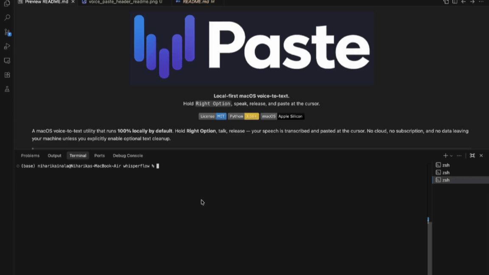

<h1 align="center">
  
  Paste
</h1>

<p align="center">
  
</p>

<p align="center">
  <strong>Local-first macOS voice-to-text.</strong><br>
  Hold <code>Right Option</code>, speak, release, and paste at the cursor.
</p>

<p align="center">
  <strong>Local-first macOS voice-to-text.</strong><br>
  Hold <code>Right Option</code>, speak, release, and paste at the cursor.
</p>

<p align="center">
  <a href="LICENSE"></a>
  <a href="https://www.python.org/"></a>
  <a href="https://support.apple.com/en-us/116943"></a>
</p>

A macOS voice-to-text utility that runs **100% locally by default**. Hold **Right Option**, talk, release — your speech is transcribed and pasted at the cursor. No cloud, no subscription, and no data leaving your machine unless you explicitly enable optional text cleanup.

> **Current UI:** VoicePaste keeps a menubar icon for quick access and also shows a floating pill overlay when AppKit overlay setup succeeds.



---

## Features

- **Hold-to-talk transcription** — hold Right Option, speak, release. Text appears at your cursor.
- **Fully local** — powered by [faster-whisper](https://github.com/SYSTRAN/faster-whisper) (OpenAI Whisper, optimized). Audio never leaves your machine.
- **Native macOS recording** — uses AVFoundation through PyObjC instead of PortAudio.
- **Floating pill overlay** — animated indicator shows idle, recording, and processing states.
- **Menubar integration** — quick-access status icon with quit option.
- **Native feedback sounds** — optional start and completion sounds use macOS system audio cues.
- **Optional AI cleanup** — enable OpenAI readability enhancement for cleaner transcripts (only text is sent, never audio).
- **Voice Activity Detection** — skips silence automatically.
- **Session logging** — persistent diagnostics with automatic retention and privacy-safe redaction.
- **Configurable** — model size, hotkey, overlay appearance, logging, and more — all in one `config.py`.

---

## Quick Start

```bash
git clone https://github.com/AkhilDevarasetty/VoicePaste.git
cd VoicePaste
make install
make run
```

Or set up manually — see [Detailed Setup](#2-setup) below.

> **First run:** `faster-whisper` will download the `base.en` model (~150 MB) from Hugging Face. Subsequent runs use the local cache.
>
> **Setup note:** `make install` creates `venv/` and installs everything from `requirements.txt`, similar to `npm install`.

---

## 1. Prerequisites

| Requirement | Notes |
|---|---|
| **macOS** on Apple Silicon (M1/M2/M3) | CPU inference only — no Metal/GPU required |
| **Python 3.10+** | 3.11 is a solid default, but the Makefile does not force one exact version |
| ~150 MB free disk | For the `base.en` Whisper model that downloads on first run |
| A working microphone | Built-in is fine |

> Already have `python3` somewhere but not sure if it's new enough? Run `python3 --version`. macOS ships with 3.9 by default — that's too old. Install a newer version with [Homebrew](https://brew.sh) (`brew install python`), [pyenv](https://github.com/pyenv/pyenv), or Anaconda.

---

## 2. Setup

The fastest way is `make install` (see [Quick Start](#quick-start)). It creates `venv/` and installs the pinned project dependencies from `requirements.txt`. To set up manually:

```bash
cd /path/to/VoicePaste

# Create a virtual environment using Python 3.10+
python3 -m venv venv

# Activate and install pinned dependencies
source venv/bin/activate
python -m pip install --upgrade pip
python -m pip install -r requirements.txt
```

If your preferred Python is not the default `python3`, pass it directly:

```bash
make install PYTHON=/opt/homebrew/bin/python3.11
```

### Optional cloud enhancement

By default, VoicePaste stays fully local with `READABILITY_MODE = "off"`. If you want transcript readability cleanup before paste, you can enable the optional OpenAI enhancement mode:

1. Add your API key to your shell environment:

```bash
export OPENAI_API_KEY="your-api-key-here"
```

To make that persistent, add the same line to your shell rc file such as `~/.zshrc`, then open a new terminal.

2. In `config.py`, change:

```python
READABILITY_MODE = "openai"
```

When this mode is enabled:
- Only the transcribed text is sent to OpenAI
- Audio never leaves your machine
- The app uses `gpt-4o-mini` to improve readability while preserving meaning
- If the API key is missing, the request times out, or the API fails, VoicePaste falls back to the raw transcript and still pastes it

---

## 3. macOS Permissions

VoicePaste requires **two** permissions in **System Settings → Privacy & Security**. 

In modern versions of macOS, these permissions must be granted to the **parent application** running the script (e.g., the terminal you use to run `python main.py`), rather than the Python executable itself.

| How you run `python main.py` | Grant permissions to |
|---|---|
| Terminal.app | Terminal |
| iTerm2 | iTerm2 |
| VS Code integrated terminal | Visual Studio Code |
| Claude Code desktop app | Claude (Anthropic) |

### 3a. Microphone (Audio Recording)

The **first time** you run the app, macOS will typically prompt you: *"Terminal would like to access the microphone"*. Click **Allow** and you're good to go.

If you missed the prompt or accidentally clicked Deny:
1. Open **System Settings → Privacy & Security → Microphone**
2. Find your terminal app (e.g., Terminal, iTerm) in the list and toggle it **on**.

### 3b. Accessibility (Hotkeys & Pasting)

Accessibility is required for two reasons:
- **pynput** uses it to listen for the global `Right-Option` hotkey in the background.
- **pynput** also uses it to send the synthetic `⌘V` keystroke that automatically pastes the transcript.

Unlike the Microphone, macOS does **not** automatically prompt you to grant Accessibility access to terminal scripts. 

Steps to enable it manually:
1. Open **System Settings → Privacy & Security → Accessibility**
2. Click the `+` button at the bottom of the list.
3. Navigate to and select the app you use to run VoicePaste (e.g., `Terminal` under Applications/Utilities, or `iTerm` / `Visual Studio Code` under Applications).
4. Make sure its toggle is **on**.
5. **Restart VoicePaste** — Accessibility permissions are only checked when the process starts.

---

## 4. Running

```bash
make run
```

Or manually: `source venv/bin/activate && python main.py`

If the `venv` is missing, `make run` now stops and tells you to run `make install` first.

You should see:

```
VoicePaste starting…
Loading Whisper model…
VoicePaste ready
Hold Right Option to record. Release to transcribe. Quit from the menubar.
```

A 🎙️ icon appears in your menubar. If the overlay initializes successfully, a floating pill near the bottom-center mirrors the current app state. Quit any time from the menubar's **Quit** entry.

Each app session also writes a persistent log file to `logs/voicepaste-YYYYMMDD-HHMMSS.log`, which captures startup, hotkey, recorder, transcriber, enhancer, paste, and shutdown diagnostics.

By default, the log file does **not** store the full transcript text. VoicePaste prints the transcript to the terminal and pastes it normally, but the file log keeps only transcript metadata such as character and word counts unless you explicitly change `LOG_SENSITIVE_CONTENT` in `config.py`.

Log files are pruned automatically using the retention settings in `config.py` (`LOG_RETENTION_DAYS` and `LOG_MAX_FILES`), and uncaught exceptions are written with tracebacks when `LOG_TRACEBACKS = True`.

---

## 5. Hotkey Usage

| Action | What happens |
|---|---|
| **Hold** Right Option | Recording starts. Menubar turns 🔴, the floating pill switches to its recording state, and the terminal prints `🎙️ Recording...` |
| **Release** Right Option | Recording stops. Menubar turns ⏳, the floating pill switches to processing, and the terminal prints `🔄 Transcribing...` |
| Optional cloud cleanup enabled | After transcription, terminal prints `✨ Enhancing...` before paste |
| Transcription completes | Menubar returns to 🎙️, the floating pill returns to idle, the transcript prints to terminal, and the text is pasted at the cursor |
| Hold longer than 60 seconds | Auto-stop kicks in (safety limit, configurable in `config.py`) and processing begins automatically |
| Hold less than 0.3 seconds | Skipped — too short, terminal warns and resets |
| Hold but say nothing (silence) | Skipped — VAD finds no speech, terminal warns and resets |

### Note on Cursor Focus

VoicePaste relies on sending a simulated `⌘V` automatically when transcription finishes. **If you record your voice without the cursor actively placed in a text field** (e.g., you click away to another app or the desktop), the automatic paste will be lost. *However, the transcribed text is still saved to your system clipboard, so you can manually paste it later.*

---

## 6. Troubleshooting

### `❌ Accessibility permission not granted.` at startup

You haven't enabled Accessibility for the app that is running VoicePaste yet. Follow **Section 3b**.

If you already added the app and still see this error, the most common cause is that macOS is tracking a stale entry. **Remove the entry** from System Settings → Privacy & Security → Accessibility (select it, click `−`), then add it again following Section 3b.

### `❌ microphone access failed: [...]` at startup

You denied the mic prompt, or never got it. Follow **Section 3a**. Same stale-entry trick applies if needed.

### `make install` says `python3` was not found

The setup flow expects a working Python 3 interpreter on your PATH.

Install Python, then rerun:

```bash
brew install python
make install
```

If you want to use a specific interpreter, pass it explicitly:

```bash
make install PYTHON=/opt/homebrew/bin/python3.11
```

### Right Option does nothing — no Recording state, no errors

This is almost always Accessibility permission silently not working. Things to try, in order:

1. Confirm the app running VoicePaste is **toggled on** in System Settings → Privacy & Security → Accessibility (the toggle, not just the presence in the list)
2. Remove the entry, restart VoicePaste, re-add it
3. Make sure no other app is intercepting Right Option (Karabiner-Elements, BetterTouchTool, Logi Options+, etc.)

### `Warning: You are sending unauthenticated requests to the HF Hub.`

Cosmetic. Hugging Face is reminding you that anonymous downloads have rate limits. The `base.en` model is small and downloads once — you can ignore this. If you do hit a rate limit, set `HF_TOKEN` in your environment to a free Hugging Face token.

### Transcript is wrong / poor quality

`base.en` is the default English-only model — fast and lightweight. To upgrade, edit `config.py`:

```python
MODEL_SIZE = "small.en"   # or "medium.en", "large-v3"
```

Larger models are slower and use more RAM, but usually transcribe more accurately. `small.en` is a good middle ground on M1.

### Verify the model loads at all

Before debugging the full app, run the standalone model-load smoke test:

```bash
source venv/bin/activate
python test.py
```

You should see two timestamped lines and `model loaded: WhisperModel`. If this fails but `pip install` succeeded, it's almost always a corrupted Hugging Face cache — delete `~/.cache/huggingface/hub/models--Systran--faster-whisper-base.en/` and re-run.

### Transcribing is slow

The first transcription after startup is always slower (model warm-up). Subsequent ones should be ~1–3 seconds for short clips on M1. If they're consistently slow:

- Check Activity Monitor — make sure nothing else is pegging the CPU
- Try `COMPUTE_TYPE = "int8"` (already the default) which is the fastest CPU mode
- Drop to a smaller model in `config.py`

### `pip install` fails building a wheel

Some dependencies rely on Apple frameworks through PyObjC. If the build fails, install Xcode Command Line Tools and try again:

```bash
xcode-select --install
```

## Project Layout

```
VoicePaste/
├── main.py              Entry point — wires recorder, transcriber, overlay, paster, and logging
├── recorder.py          Native macOS microphone capture via AVFoundation (PyObjC)
├── transcriber.py       Whisper model loading + transcription (faster-whisper)
├── enhancer.py          Optional transcript readability cleanup (OpenAI)
├── hotkey.py            Global Right-Option listener (pynput)
├── paster.py            Clipboard write + synthetic Cmd+V paste
├── overlay.py           Floating pill overlay UI (AppKit)
├── app_logger.py        Session logging, retention, redaction, and tracebacks
├── config.py            All tunables — single source of truth
├── Makefile             Quick setup: make install / make run / make clean
├── requirements.txt     Pinned dependencies
├── test.py              Standalone smoke test — loads the Whisper model
├── test_enhancer.py     Small enhancer test helper
├── CONTRIBUTING.md      Guide for contributors
├── assets/              Demo assets, branding, and README media
├── logs/                Runtime-generated session logs (gitignored)
└── README.md            This file
```

All configurable values live in `config.py`. Don't hardcode anything elsewhere.

## Privacy

VoicePaste can run fully locally.

When `READABILITY_MODE = "off"`:
- audio stays on your device
- transcript cleanup stays local because no cloud enhancement is called

When `READABILITY_MODE = "openai"`:
- audio still stays on your device
- only transcript text is sent to OpenAI for cleanup
- if the enhancement step fails, VoicePaste pastes the original transcript instead of blocking

---

## Roadmap

- **Hands-free dictation** — long-form mode with a separate trigger (e.g. `Fn + Space`), no need to hold a key for paragraphs
- **Draggable overlay** — let the user reposition the floating pill, persist across restarts
- **Local AI enhancement** — replace OpenAI with a local LLM (Ollama) for fully offline readability cleanup
- **Chunk-aware readability** — combine burst dictation chunks before running a single AI cleanup pass
- **Voice formatting** — spoken commands like "new line", "bullet point", "paragraph break"
- **Voice workflows** — spoken requests like "rewrite", "summarize", "improve tone"
- **Voice agent actions** — spoken commands that trigger computer actions with safety confirmations
